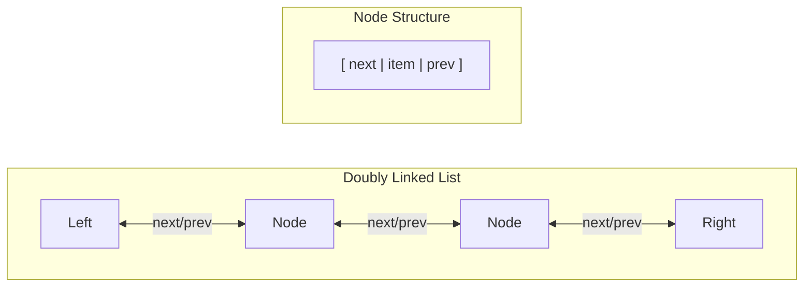

# Deque (Deck) in C++

Simple deque template class (doubly-linked list) implemenation in C++.

> C++ deque implements doubly-linked list using arry of array, which latter contains index of the next and previous node.

## Structure



```mermaid
classDiagram
    class Node {
        +next: shared_ptr Node*
        +prev: share_ptr Node*
        +data: template T
    }
    
    class Deque {
        +left: shared_ptr Node*
        +right: shared_ptr Node*
    }
    
    Node <-- Deque : contains
````

## functions

bool isEmpty() { return static_cast<bool>(N <= 0); }

int size() { return N; }

void pushLeft(T item);

void pushRight(T item);

T popLeft();

T popRight();

T peekLeft();

T peekRight();

## TODO

1. add c++20 concepts

## To run the code

```bash
cmake -S . --preset=debug -B build
```

or

```bash
cmake -S . --preset=release -B build
```

then run

```bash
cmake --build build
```

or

```bash
cd build && ninja clean && ninja
```

and executable will exist in the `build/` directory.

to generate compile_commands.json file for clangd LSP, use

```bash
cmake -DCMAKE_EXPORT_COMPILE_COMMANDS=1 .. --preset=${PRESET_NAME}

cd ${ROOT_DIRECTORY}

ln -s build/compile_commands.json
```
